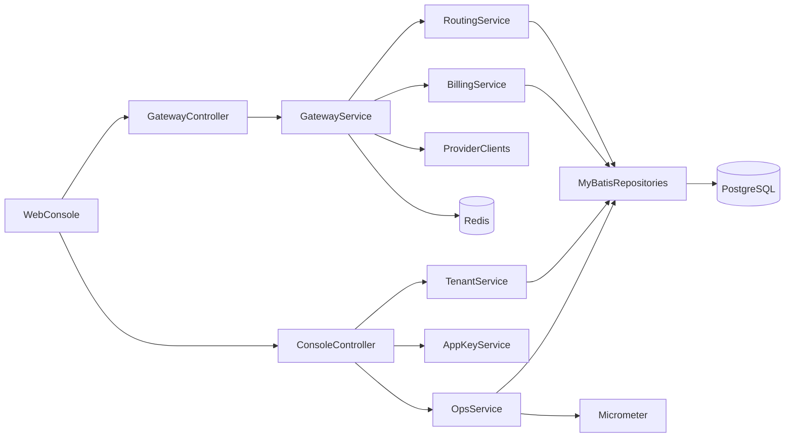

# Java 后端替换技术栈方案

## 目标

将当前基于 Node.js/Fastify/Prisma 的后端，替换为适合商业化 B2B SaaS 的 Java 后端实现，同时保持以下核心能力不退化：

- OpenAI 兼容网关：`POST /v1/chat/completions`
- 多租户、RBAC、AppKey、预算与计费
- 多模型供应商适配与 fallback
- 审计日志、运营接口、财务相关接口
- 与现有前端 API 尽量兼容，降低联调与切换成本

## 当前后端现状

当前后端主要集中在这些位置：

- 启动入口：`backend-java/src/main/java/com/taas/boot/TaasApplication.java`
- 控制台与认证：`backend-java/src/main/java/com/taas/console/`、`backend-java/src/main/java/com/taas/auth/`
- 网关与供应商适配：`backend-java/src/main/java/com/taas/gateway/`
- 数据库迁移：`backend-java/src/main/resources/db/migration/`
- 基础设施与安全：`backend-java/src/main/java/com/taas/infra/`

现状问题：

- 业务逻辑集中在单文件，后续扩展成本高
- Node.js 方案适合快速迭代，但对企业级标准交付、团队协作、长期维护、审计与治理不如 Java 体系成熟
- 商业化后会更依赖 Java 常见能力：
  - 统一分层架构
  - 更强的类型约束
  - 更成熟的企业中间件生态
  - 更容易适配大客户 Java 技术栈与私有化要求

## 推荐目标技术栈

推荐采用下面这套主栈：

- 语言：`Java 21`
- 框架：`Spring Boot 3.x`
- 构建：`Maven`
- Web：`Spring WebMVC`
- 外部 HTTP 调用：`Spring WebClient`
- 安全：`Spring Security + JWT`
- 数据访问：`MyBatis-Flex` 或 `MyBatis`
- 数据库迁移：`Flyway`
- 参数校验：`Jakarta Validation`
- 配置管理：`Spring Boot Config + profile`
- 缓存/限流/幂等：`Redis`
- 异步与事件：先用 `Spring Events`，后续可演进到 `Kafka/RabbitMQ`
- 可观测性：`Micrometer + Prometheus + Grafana`
- 日志：`Logback + JSON logging`
- API 文档：`springdoc-openapi`
- 测试：`JUnit 5 + Mockito + Testcontainers`

## 为什么不建议继续沿用 ORM 风格迁移为 JPA 优先

这个项目的核心不是传统 CRUD，而是：

- 网关请求编排
- 计费快照
- 审计日志
- 预算控制
- 运营统计
- 路由与供应商健康

这类场景里 SQL 可控性比对象关系映射更重要，所以更推荐：

- `MyBatis / MyBatis-Flex`

而不是一开始就重度依赖：

- `Spring Data JPA`

JPA 不是不能用，但在账单、聚合、审计、运营统计上，后期容易出现查询不透明、性能和调优困难的问题。

## 目标架构



## Java 模块拆分建议

建议按业务边界拆模块，而不是按技术组件堆包。

### 1. `taas-api`

职责：

- Controller
- DTO
- 请求校验
- OpenAPI

建议包结构：

```text
com.taas.api
  controller
  dto
  response
  advice
```

### 2. `taas-auth`

职责：

- JWT 生成与校验
- Spring Security 配置
- RBAC
- 登录、注册、成员权限

建议包结构：

```text
com.taas.auth
  config
  jwt
  security
  service
```

### 3. `taas-gateway`

职责：

- OpenAI 兼容协议接入
- 模型路由
- fallback
- 幂等
- 限流
- 上游调用封装

当前对应的 Java 模块：

- `backend-java/src/main/java/com/taas/gateway/GatewayService.java`
- `backend-java/src/main/java/com/taas/gateway/provider/`
- `backend-java/src/main/java/com/taas/gateway/`

建议包结构：

```text
com.taas.gateway
  controller
  service
  provider
  routing
  idempotency
  ratelimit
```

### 4. `taas-billing`

职责：

- 计费快照
- 预算控制
- 用量聚合
- 账单、订阅、对账

当前对应的 Java 模块：

- `backend-java/src/main/java/com/taas/console/ConsoleService.java`
- `backend-java/src/main/java/com/taas/console/FinanceService.java`

### 5. `taas-ops`

职责：

- 审计日志
- 运营概览
- 供应商健康
- 风控与告警

### 6. `taas-infra`

职责：

- MyBatis Mapper
- Redis
- WebClient
- 配置类
- Flyway
- 通用工具

## 关键技术选型映射

| 当前 | 目标 Java |
|---|---|
| Fastify | Spring Boot WebMVC |
| Prisma | MyBatis / MyBatis-Flex |
| Zod | Jakarta Validation |
| jsonwebtoken | Spring Security + JWT |
| dotenv | Spring `application.yml` + profiles |
| 内存 Map 限流/幂等 | Redis |
| 手写 provider 调用 | WebClient ProviderClient |
| 脚本迁移 | Flyway |

## 数据库层迁移建议

数据库建议继续保留 PostgreSQL，不建议在“语言迁移”阶段同时更换数据库。

原因：

- 当前数据模型已经较完整
- 前后端联调重点不在数据库替换
- 降低一次性变更风险

迁移方式建议：

1. 保留现有 PostgreSQL 表结构语义
2. 将 Prisma schema 转换为 Flyway SQL 迁移脚本
3. Java 新服务直接接管同一套表结构
4. 后续再逐步优化表名、索引和审计表结构

### 优先保留的核心表

- `users`
- `tenants`
- `tenant_members`
- `providers`
- `app_keys`
- `api_request_logs`
- `usage_records`
- `billing_records`
- `tenant_routing_strategies`
- `tenant_cache_settings`
- `audit_logs`
- `subscriptions`
- `wallet_recharge_orders`
- `invoice_requests`

## 接口兼容策略

为了不影响前端和客户 SDK，Java 后端第一阶段要保持这些接口路径不变：

- `/auth/login`
- `/auth/register`
- `/me`
- `/dashboard/summary`
- `/app-keys`
- `/usage`
- `/billing`
- `/billing/overview`
- `/routing/summary`
- `/routing/strategy`
- `/optimization/*`
- `/ops/*`
- `/v1/chat/completions`

建议策略：

- 第一阶段：Java 服务完全兼容旧接口
- 第二阶段：新增 `/admin/*`、`/internal/*`
- 第三阶段：再考虑清理旧演示路径

## 供应商适配实现建议

Java 里建议定义统一接口：

```java
public interface ProviderClient {
    String providerType();
    ChatCompletionResult chat(ChatCompletionCommand command);
}
```

实现类：

- `OpenAiProviderClient`
- `AnthropicProviderClient`
- `GoogleGeminiProviderClient`

路由层：

- `RoutingService`
- `ProviderHealthService`
- `FallbackPolicyService`

这样可以把当前 Node 中散落在 `routes.ts`、`gateway.ts` 里的逻辑真正拆开。

## 安全能力在 Java 中的实现建议

### 1. 鉴权

- 控制台接口：JWT
- 网关接口：AppKey
- 管理后台：JWT + 高权限角色

### 2. RBAC

租户角色建议统一为：

- `OWNER`
- `ADMIN`
- `BILLING`
- `DEVELOPER`
- `VIEWER`

### 3. AppKey

建议保留当前商业化设计：

- 哈希存储
- 仅创建时展示一次明文
- scope 控制
- environment 控制
- 日/月预算
- 最近使用 IP

### 4. 审计

所有关键操作必须入库：

- 登录
- 创建/修改/撤销 AppKey
- 修改路由策略
- 修改供应商配置
- 修改预算与计费配置
- 审核充值/发票

## Redis 引入建议

Java 化之后，建议把这些从内存切换到 Redis：

- 幂等缓存
- 网关限流
- 临时 provider 健康状态
- 登录风控计数

不要继续保留进程内 `Map` 方案，否则横向扩容后行为会不一致。

## 可观测性与运维建议

Java 商用后端建议原生接入：

- `/actuator/health`
- `/actuator/metrics`
- Prometheus scrape
- Grafana dashboard

最少监控项：

- 网关 QPS
- 各供应商成功率
- 各供应商延迟
- 预算超限次数
- 账单生成失败次数
- 审计日志写入失败次数
- 数据库慢查询

## 替换实施方式

不建议一次性推倒重写上线，建议采用“双栈迁移”。

### 阶段 1：Java 新服务骨架

目标：

- 起一个独立 `server-java/` 或 `backend-java/`
- 打通 Spring Boot、数据库连接、基础安全、中间件

输出：

- 可启动服务
- 健康检查
- Flyway
- OpenAPI

### 阶段 2：先迁控制台接口

优先迁移：

- `/auth/*`
- `/me`
- `/app-keys`
- `/billing/*`
- `/routing/*`
- `/ops/*`

原因：

- 这部分相对可控
- 不涉及高频上游调用
- 适合先完成控制台切换

### 阶段 3：再迁网关接口

优先迁移：

- `/v1/chat/completions`

要求：

- 与旧 Node 接口响应格式兼容
- 支持 provider fallback
- 保证账单落库一致

### 阶段 4：灰度切流

建议方式：

- 前端控制台先切 Java
- 网关流量按租户或按 AppKey 灰度
- 保留 Node 后端一段时间作为回退

## 目录建议

建议在仓库中新增：

```text
backend-java/
  pom.xml
  src/main/java/com/taas/
    api/
    auth/
    gateway/
    billing/
    ops/
    infra/
  src/main/resources/
    application.yml
    db/migration/
```

该步骤已完成：仓库默认后端已经收敛到 `backend-java/`，旧 Node 后端目录已移除。

## 里程碑建议

### 里程碑 1

Java 服务启动，接管认证、租户、AppKey、账单查询。

### 里程碑 2

Java 服务接管路由、运营、审计与供应商配置。

### 里程碑 3

Java 服务接管 `/v1/chat/completions`，Node 只保留回退能力。

### 里程碑 4

移除 Node 主后端，仅保留 Java 后端。

## 风险与注意事项

### 1. 不要同时做三件事

避免在一次项目中同时做：

- 语言切换
- 数据库重构
- API 大改版

建议只先做“语言切换 + 保持接口兼容”。

### 2. 账单一致性要优先验证

最容易出事故的不是登录，而是：

- token 统计
- 账单金额
- fallback 后计费归属
- 缓存命中是否收费

Java 替换时必须给这部分做回归验证。

### 3. 幂等与审计不能退化

商业化项目里，迁移后最不能丢的是：

- 幂等
- 审计
- 预算控制
- AppKey 安全

### 4. provider SDK 不要过度绑定

尽量通过统一适配层包住上游 SDK 或 HTTP 调用，不要让业务层直接依赖 OpenAI/Anthropic/Gemini 的原始模型结构。

## 最终建议

如果目标是“商用、可私有化、可长期维护”，推荐结论是：

- 前端继续保留 React/Vite
- 后端迁移到 `Java 21 + Spring Boot 3 + MyBatis + Flyway + Redis + Spring Security`
- 采用双栈灰度迁移，而不是一次性重写切换

这样最适合你当前这个项目的商业化方向，也最容易被企业客户接受。
